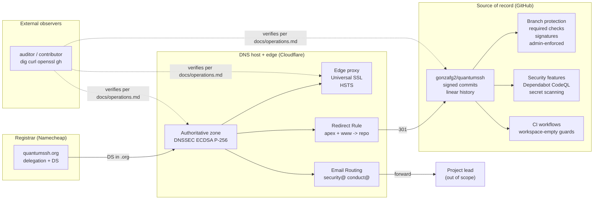

# Infrastructure

This document describes the third-party services QuantumSSH depends on
and the configurations that connect them. The reasoning behind each
non-obvious choice lives in its own Architecture Decision Record under
[`docs/adr/`](./adr/); this document cites them rather than restating
them.

It is a companion to [`operations.md`](./operations.md), which contains
copy-pasteable commands that verify the same configurations from the
outside. Where this document says *what* is set, that one says *how to
check that what is described here is what is actually deployed*, and
the ADRs say *why*.

During Phase 0 the project has no running service: there is no SSH
server to deploy, no API to monitor, no database to back up. The
infrastructure described below supports the project's identity, the
integrity of its source, the inbound channels for collaboration and
security reports, and the trust artefacts (signed commits, published
PGP key) that the manifesto's "open source, really" commitment depends
on.

## Status and scope

QuantumSSH closed Phase 0 on 2026-05-10. The repository scaffolding,
governance documents, CI workflows, project PGP key, DNS zone with
DNSSEC, TLS termination with HSTS, CAA whitelist, inbound email
forwarding, and branch protection on `main` were all put in place
across that single window. No Rust source code has been written yet;
the `Cargo.toml` is a virtual manifest with no member crates (see
[Workspace topology](#workspace-topology) for the rationale).

This document is gap-honest. The project does **not** currently publish
an SLO or a status page, does not run a third-party security audit (one
is planned for Phase 3 per the roadmap in `README.md`), and does not
operate a bug bounty programme. The single-maintainer governance during
Phases 0-2 is documented in [`GOVERNANCE.md`](../GOVERNANCE.md), as is
the formal commitment to transition to a maintainer team when criteria
are met. None of those gaps are hidden in the verification recipes:
[`operations.md`](./operations.md) tells external observers what they
can confirm, and by omission what they cannot.

## Service topology

Four parties, three operational dependencies:

- **Namecheap** holds the `.org` registration and publishes the DNSSEC
  DS record to the parent zone. Its only ongoing job is to renew the
  domain and keep the DS record current.
- **Cloudflare** hosts the authoritative DNS zone, terminates TLS at
  the edge, redirects HTTP traffic to the repository, and forwards
  inbound email to the maintainer's destination address.
- **GitHub** holds the source of record, runs the CI workflows,
  enforces branch protection, and operates the security-feature stack
  (Dependabot, CodeQL, secret scanning, push protection).
- **External observers** verify all of the above using only public
  endpoints, with the recipes in [`operations.md`](./operations.md).
  The solid edges in the diagram are configuration; the dotted edges
  are verification — they are deliberately different concerns.

## Domain and DNS

### Registrar — Namecheap

The registrar's job in this project is narrow: hold the `.org`
delegation and publish the DNSSEC DS record to the parent zone.
Domain renewal is set to auto-renew. A registrar lapse would break the
redirect, invalidate the inbound email aliases, and silently take the
DNSSEC chain out of trust (the DS record in `.org` references this
zone's KSK). The standard registrar grace period applies if auto-renew
ever fails.

Decision rationale: see [ADR-0002](./adr/0002-registrar-namecheap.md).

### DNS host — Cloudflare

Cloudflare's free plan hosts the authoritative DNS zone, terminates TLS
at the edge (Universal SSL), runs the apex/`www` redirect rule, and
forwards inbound email via Email Routing. The zone is served by two
Cloudflare anycast nameservers, fixed by the free plan.

Decision rationale: see [ADR-0001](./adr/0001-dns-host-cloudflare.md).

### DNSSEC

The zone is signed end-to-end. The KSK and ZSK use ECDSA P-256
(algorithm 13), which yields short signatures and broad resolver
support. The DS record was submitted to the `.org` parent zone via the
Namecheap UI; once it propagated, the `AD` flag started returning from
validating resolvers within minutes.

Coverage caveat: Lumen / Level3 public resolvers (`4.2.2.2` and the
neighbouring `4.2.2.x` addresses) historically do not perform DNSSEC
validation. They will continue to resolve the zone correctly but will
never set the `AD` flag. This is a property of those resolvers, not the
zone, and it affects every DNSSEC-signed domain identically. Cloudflare
(`1.1.1.1`), Google (`8.8.8.8`), Quad9 (`9.9.9.9`), OpenDNS, and
Verisign all validate. See [`operations.md`](./operations.md) for the
exact `dig` invocation.

### Records reference

| Record | Name | Purpose |
|---|---|---|
| A (proxied) | `quantumssh.org` | Apex, Cloudflare anycast handles all traffic |
| CNAME (proxied) | `www` | Flattens to apex; subject to the same Redirect Rule |
| MX | `quantumssh.org` | Three Cloudflare Email Routing endpoints, priorities 11/20/44 |
| TXT (SPF) | `quantumssh.org` | `v=spf1 include:_spf.mx.cloudflare.net ~all`, auto-managed |
| TXT (DMARC) | `_dmarc` | `v=DMARC1; p=reject; rua=...` — see [Authentication posture](#authentication-posture) |
| TXT (DKIM) | `cf2024-1._domainkey` | Auto-managed by Cloudflare Email Routing |
| CAA | `quantumssh.org` | Eleven records — see [Certificate Authority Authorization](#certificate-authority-authorization) |
| DNSKEY | `quantumssh.org` | KSK + ZSK, ECDSA P-256 (algorithm 13) |

Reproducing these records requires registrar and DNS-host accounts the
project does not share; the `dig` invocations to read them are in
[`operations.md`](./operations.md).

## Web endpoints

### Apex and www redirect

`https://quantumssh.org` and `https://www.quantumssh.org` return HTTP
301 to `https://github.com/gonzafg2/quantumssh`, preserving the request
path. A request for `https://quantumssh.org/issues` redirects to
`https://github.com/gonzafg2/quantumssh/issues`. The implementation is
a Cloudflare Redirect Rule (their successor to Page Rules) rather than
a static page or a GitHub Pages site, because the project does not yet
have a website and a stateless 301 is the least machinery that
satisfies the use case. When a project site exists in the future the
Redirect Rule will be disabled or replaced; the DNS records and the
proxy state can stay.

HTTP requests are upgraded to HTTPS on the **same host** first, by
Cloudflare's "Always Use HTTPS" setting, before the Redirect Rule
fires. The rule's filter is scoped to `ssl` so it does not match HTTP
traffic and bypass the upgrade; the resulting chain for an HTTP request
is two 301 hops (`http://quantumssh.org/X` → `https://quantumssh.org/X`
→ `https://github.com/gonzafg2/quantumssh/X`), with the first hop
staying on the project's own host. This shape is required for HSTS
preload-list eligibility — see
[ADR-0014](./adr/0014-hsts-preload-submitted.md).

### TLS posture

TLS 1.0 and TLS 1.1 are rejected at handshake time; TLS 1.2 and TLS 1.3
are supported with modern AEAD ciphers only. The HSTS header is served
with `max-age=31536000; includeSubDomains; preload` (one year). The
domain has been **submitted** to the browser HSTS preload list
(`hstspreload.org` status: `pending`, awaiting inclusion in the next
Chromium release; other browsers follow on their own cadence).

Decision rationale: the original ADR setting the header lives at
[ADR-0003](./adr/0003-hsts-preload-deferred.md); the subsequent bump
from 6-month to 1-year `max-age` is recorded in
[ADR-0012](./adr/0012-hsts-max-age-bumped-to-one-year.md); the
preload-list submission itself (and the Redirect Rule scope change
that made the domain preload-eligible) is recorded in
[ADR-0014](./adr/0014-hsts-preload-submitted.md), which together with
ADR-0012 fully supersedes ADR-0003.

The certificate is part of Cloudflare's Universal SSL pool; the current
chain is from Let's Encrypt, but Cloudflare may rotate the issuing CA
across renewals among the authorities listed in
[Certificate Authority Authorization](#certificate-authority-authorization)
below. [`operations.md`](./operations.md) has the `openssl s_client`
invocation that prints the live cert.

### Certificate Authority Authorization

The project's explicit CAA records authorise Let's Encrypt and Google
Trust Services. Cloudflare auto-injects six additional records covering
the CAs it may rotate to for Universal SSL renewals (Sectigo, DigiCert,
SSL.com, each for both `issue` and `issuewild`). The effective policy
is a whitelist of five well-known CAs. An IODEF mailto record routes
CAA-violation notifications to `security@quantumssh.org`.

Decision rationale (keeping the auto-injected pool): see
[ADR-0007](./adr/0007-caa-whitelist-includes-cloudflare-pool.md).

## Email

### Inbound aliases

Two aliases accept mail under the project domain:

- `security@quantumssh.org` — embargoed security disclosures
  ([`SECURITY.md`](../SECURITY.md) is authoritative on the process)
- `conduct@quantumssh.org` — Code of Conduct reports
  ([`CODE_OF_CONDUCT.md`](../CODE_OF_CONDUCT.md))

Both are configured through Cloudflare Email Routing and forwarded to
the project lead's verified destination address. The project does not
operate its own mail server. There is no shared inbox, no ticketing
system, and no out-of-hours coverage beyond the maintainer's
availability.

### Authentication posture

DMARC is published with `p=reject` and an aggregate-reporting URI.
DMARC-compliant receivers are instructed to reject mail that fails
alignment under `quantumssh.org` outright; `p=reject` is a policy
*request* and enforcement varies across the receiver ecosystem (major
mailbox providers honour it, some legacy mailservers ignore DMARC
entirely). SPF and DKIM records are auto-managed by Cloudflare Email
Routing for the receiving side.

Decision rationale: the original observation-window stance at `p=none`
is recorded in [ADR-0004](./adr/0004-dmarc-p-none-monitoring.md); the
subsequent tightening directly to `p=reject` (skipping the
intermediate `p=quarantine` step that ADR-0004 had contemplated, on
the grounds that the project sends no outbound mail) is recorded in
[ADR-0013](./adr/0013-dmarc-tightened-to-p-reject.md).

## Identity and signing

### Project PGP key

The project security PGP key is published at
[`keys/security.asc`](../keys/security.asc) and its fingerprint is
recorded in [`SECURITY.md`](../SECURITY.md). The key is Ed25519 for
sign and cert, with a Curve25519 subkey for encryption, and expires two
years from issue. Rotation is reminded 60 and 30 days before expiry.

Decision rationale (the two-year expiry): see
[ADR-0005](./adr/0005-pgp-key-two-year-expiry.md).

Fingerprint verification, key import, and the embargoed-disclosure
workflow itself are documented in [`SECURITY.md`](../SECURITY.md) and
in the "Project PGP key" section of [`operations.md`](./operations.md).

### Commit signing

Commit signatures are produced by an SSH key (Ed25519), not a GnuPG
key. The same SSH key is used for authenticating to GitHub, so the
trust root is a public artefact already exposed at
`api.github.com/users/<maintainer>/ssh_signing_keys`. PGP remains the
project's tool for embargoed-disclosure encryption; the two roles are
intentionally separated by tool.

Decision rationale (SSH-not-GPG): see
[ADR-0006](./adr/0006-commit-signing-ssh-not-gpg.md).

External signature verification is documented in
[`operations.md`](./operations.md).

## Repository hardening

### Branch protection on `main`

The `main` branch enforces signed commits, linear history, all CI
status checks passing, and merges only via pull request. It does not
require human approving reviews. Force pushes are disallowed, deletion
is disallowed, and admins are not exempt (`enforce_admins` is `true`).

Decision rationale (the zero approving-reviews configuration during
solo maintainership): see
[ADR-0008](./adr/0008-branch-protection-zero-required-reviews.md).

### Required status checks

Three CI contexts must report success before a PR can merge:

- `build (ubuntu-latest)` — formats, lints, tests, and builds on Linux
- `build (macos-latest)` — same on macOS
- `cargo deny` — license, advisories, sources, and bans

The full configuration is readable via `gh api` (see
[`operations.md`](./operations.md) for the invocation).

### Security features

Server-side, the repository runs:

- **Dependabot** vulnerability alerts and automated security updates
- **CodeQL** default setup (Rust + GitHub Actions analysis)
- **Secret scanning** with push protection
- **GitGuardian** account-level scan on every PR
- **`cargo-deny`** action on every PR
- **`cargo-audit`** on a weekly cron (Mondays 06:00 UTC)

All of these are configured to fail loud, not silent. The cron and the
PR action are gated by lightweight predicates while the workspace is
still empty (see [CI guard implementation note](#ci-guard-implementation-note)).

## Build and CI scaffolding

### Workspace topology

The `Cargo.toml` at the repo root is a workspace manifest with
`members = []`. There is no Rust source code yet; the workspace-level
structural decisions are locked in ahead of the first crate so Phase 1
inherits them without retrofitting. The CI workflows guard against
Cargo's refusal to operate on an empty manifest until the first crate
lands; the guards self-disable on that event.

Decision rationale (shipping the virtual manifest in Phase 0): see
[ADR-0009](./adr/0009-workspace-no-members-during-phase-0.md).

### Toolchain and edition

The workspace pins `resolver = "3"`, `edition = "2024"`, and
`rust-version = "1.92"`. The `rust-toolchain.toml` pins the channel to
current stable. Workspace lints include `unsafe_code = "deny"` by
default; opting into `unsafe` will be a deliberate per-block decision
with justification, review, and tests — per the "memory-safe by
construction" commitment in `README.md`.

Decision rationale (the specific resolver / edition / MSRV pinning):
see [ADR-0010](./adr/0010-toolchain-pinning-resolver-3-edition-2024-msrv-1-92.md).

### CI guard implementation note

Each CI workflow that runs a Cargo subcommand is gated by a small
predicate, but the predicates are not the same across the three
workflows: they match the actual failure mode of the Cargo command
they protect.

- `ci.yml` and `deny.yml` are gated on **`workspace.members` being
  non-empty**, read from `Cargo.toml` with the standard-library
  `tomllib` module. These workflows run `cargo fmt`, `cargo clippy`,
  `cargo test`, `cargo build`, and `cargo-deny` — all of which refuse
  to operate on a virtual manifest with no members.
- `audit.yml` is gated on **`Cargo.lock` being present**, via a
  one-line bash test. `cargo-audit` scans the lockfile rather than
  the manifest, so it cares about the lockfile's existence rather
  than the workspace's member list.

Both predicates self-disable when their respective condition resolves;
neither requires a workflow edit at the Phase 0 → Phase 1 transition.

Decision rationale (why two narrow predicates rather than one shared
mechanism): see [ADR-0011](./adr/0011-ci-guards-workspace-state.md).

## Calendar of time-bound actions

| Date | Event |
|---|---|
| 2026-07-10 | HSTS preload submit-or-skip decision (≈60 days post-activation) |
| 2027-05-10 | Annual security posture review |
| 2028-03-10 | PGP rotation: 60-day warning before expiry |
| 2028-04-09 | PGP rotation: 30-day final warning |
| 2028-05-09 | Project PGP key expires |
| Quarterly | TLS cert is renewed automatically by Cloudflare (Let's Encrypt 90-day cadence); no maintainer action required |

Material changes to any of these dates, or new entries, are reflected
in `CHANGELOG.md` and announced via the `security` label on the issue
tracker.

## What this document does not cover

- **Verification commands** for any of the configurations above:
  [`operations.md`](./operations.md).
- **Decision rationale** for each non-obvious configuration: the
  Architecture Decision Records under [`docs/adr/`](./adr/), cited
  inline above.
- **Embargoed-disclosure process**, PGP fingerprint, response targets,
  scope and exclusions: [`SECURITY.md`](../SECURITY.md).
- **Governance**, license commitments, maintainer-team transition
  criteria, the RFC-vs-ADR boundary: [`GOVERNANCE.md`](../GOVERNANCE.md).
- **Project vision** and the "Open source, really" commitments:
  [`README.md`](../README.md) (English),
  [`MANIFIESTO.es.md`](../MANIFIESTO.es.md) (Spanish).
- **Threat model**: [`docs/threat-model.md`](./threat-model.md)
  (currently a skeleton; will be substantiated before the first
  cryptographic code lands).
- **Contribution workflow**, DCO sign-off, commit conventions:
  [`CONTRIBUTING.md`](../CONTRIBUTING.md).
- **Per-record DNS step-by-step or registrar / DNS-host panel
  walk-throughs**: not public. This document states what is
  configured; reproducing it requires accounts the project does not
  share.

## Change log of this document

Material changes to the configurations described above are recorded in
`CHANGELOG.md` under the relevant section. Drift between this document
and externally observable reality should be reported via the embargoed
channel in [`SECURITY.md`](../SECURITY.md) — divergence between
documented and deployed state is itself meaningful information.
