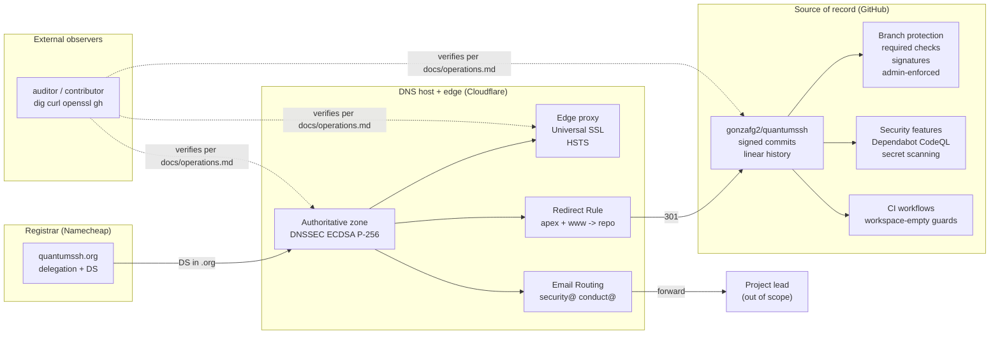

# Infrastructure

This document describes the third-party services QuantumSSH depends on,
the configurations that connect them, and the reasoning behind each
non-obvious choice. It is a companion to [`operations.md`](./operations.md),
which contains copy-pasteable commands that verify the same
configurations from the outside. Where this document says *what* is set
and *why*, that one says *how to check that what is described here is
what is actually deployed*.

During Phase 0 the project has no running service: there is no SSH
server to deploy, no API to monitor, no database to back up. The
infrastructure described below supports the project's identity, the
integrity of its source, the inbound channels for collaboration and
security reports, and the trust artefacts (signed commits, published
PGP key) that the manifesto's "open source, really" commitment depends
on.

## Status and scope

QuantumSSH closed Phase 0 on 2026-05-10. The repository scaffolding,
governance documents, CI workflows, project PGP key, DNS zone with
DNSSEC, TLS termination with HSTS, CAA whitelist, inbound email
forwarding, and branch protection on `main` were all put in place
across that single window. No Rust source code has been written yet;
the `Cargo.toml` is a virtual manifest with no member crates (see
[Workspace topology](#workspace-topology) for the rationale).

This document is gap-honest. The project does **not** currently publish
an SLO or a status page, does not run a third-party security audit (one
is planned for Phase 3 per the roadmap in `README.md`), and does not
operate a bug bounty programme. The single-maintainer governance during
Phases 0-2 is documented in [`GOVERNANCE.md`](../GOVERNANCE.md), as is
the formal commitment to transition to a maintainer team when criteria
are met. None of those gaps are hidden in the verification recipes:
[`operations.md`](./operations.md) tells external observers what they
can confirm, and by omission what they cannot.

## Service topology

Four parties, three operational dependencies:

- **Namecheap** holds the `.org` registration and publishes the DNSSEC
  DS record to the parent zone. Its only ongoing job is to renew the
  domain and keep the DS record current.
- **Cloudflare** hosts the authoritative DNS zone, terminates TLS at
  the edge, redirects HTTP traffic to the repository, and forwards
  inbound email to the maintainer's destination address.
- **GitHub** holds the source of record, runs the CI workflows,
  enforces branch protection, and operates the security-feature stack
  (Dependabot, CodeQL, secret scanning, push protection).
- **External observers** verify all of the above using only public
  endpoints, with the recipes in [`operations.md`](./operations.md).
  The solid edges in the diagram are configuration; the dotted edges
  are verification — they are deliberately different concerns.

## Domain and DNS

### Registrar — Namecheap

The registrar's job in this project is narrow: hold the `.org`
delegation and publish the DNSSEC DS record to the parent zone.
Namecheap was chosen because (a) it supports DS submission via a
self-service UI, (b) its renewal pricing is below the .org wholesale
floor, and (c) it has no privacy-stripping requirements for
non-commercial domains. Cloudflare Registrar was the preferred
alternative for the wholesale-price reason but the project lead's
existing Namecheap account made onboarding immediate. `.cl` (NIC Chile)
was considered as a Latin-American alternative but would have
constrained the project's identity geographically without operational
gain.

Domain renewal is set to auto-renew. A registrar lapse would break the
redirect, invalidate the inbound email aliases, and silently take the
DNSSEC chain out of trust (the DS record in `.org` references this
zone's KSK). The standard registrar grace period applies if auto-renew
ever fails.

### DNS host — Cloudflare

Cloudflare's free plan gives the project DNSSEC at no cost, native CAA
management, an HSTS toggle in the UI, an Email Routing service that
does not require running our own MTA, a Redirect Rule mechanism that
does not require an origin server, and anycast resolution across
hundreds of POPs. The alternatives considered were running our own
DNS (operationally disproportionate for a project that has no traffic),
NS1 or Route53 (not free), and DigitalOcean DNS (free but lacks
Redirect Rules and Email Routing). The downside is dependency on a
single commercial provider with significant power to deplatform; we
accept this in exchange for operational simplicity and document the
migration paths in the recovery procedures.

The zone is served by two Cloudflare anycast nameservers, fixed by the
free plan. They are visible in the `NS` records and not selected by the
project.

### DNSSEC

The zone is signed end-to-end. The KSK and ZSK use ECDSA P-256
(algorithm 13), which yields short signatures and broad resolver
support. The DS record was submitted to the `.org` parent zone via the
Namecheap UI; once it propagated, the `AD` flag started returning from
validating resolvers within minutes.

Coverage caveat: Lumen / Level3 public resolvers (`4.2.2.2` and the
neighbouring `4.2.2.x` addresses) historically do not perform DNSSEC
validation. They will continue to resolve the zone correctly but will
never set the `AD` flag. This is a property of those resolvers, not the
zone, and it affects every DNSSEC-signed domain identically. Cloudflare
(`1.1.1.1`), Google (`8.8.8.8`), Quad9 (`9.9.9.9`), OpenDNS, and
Verisign all validate. See [`operations.md`](./operations.md) for the
exact `dig` invocation.

### Records reference

| Record | Name | Purpose |
|---|---|---|
| A (proxied) | `quantumssh.org` | Apex, Cloudflare anycast handles all traffic |
| CNAME (proxied) | `www` | Flattens to apex; subject to the same Redirect Rule |
| MX | `quantumssh.org` | Three Cloudflare Email Routing endpoints, priorities 11/20/44 |
| TXT (SPF) | `quantumssh.org` | `v=spf1 include:_spf.mx.cloudflare.net ~all`, auto-managed |
| TXT (DMARC) | `_dmarc` | `v=DMARC1; p=none; rua=...` — see [Authentication posture](#authentication-posture) |
| TXT (DKIM) | `cf2024-1._domainkey` | Auto-managed by Cloudflare Email Routing |
| CAA | `quantumssh.org` | Eleven records — see [Certificate Authority Authorization](#certificate-authority-authorization) |
| DNSKEY | `quantumssh.org` | KSK + ZSK, ECDSA P-256 (algorithm 13) |

Reproducing these records requires registrar and DNS-host accounts the
project does not share; the `dig` invocations to read them are in
[`operations.md`](./operations.md).

## Web endpoints

### Apex and www redirect

`https://quantumssh.org` and `https://www.quantumssh.org` return HTTP
301 to `https://github.com/gonzafg2/quantumssh`, preserving the request
path. A request for `https://quantumssh.org/issues` redirects to
`https://github.com/gonzafg2/quantumssh/issues`. The implementation is
a Cloudflare Redirect Rule (their successor to Page Rules) rather than
a static page or a GitHub Pages site, because the project does not yet
have a website and a stateless 301 is the least machinery that
satisfies the use case. When a project site exists in the future the
Redirect Rule will be disabled or replaced; the DNS records and the
proxy state can stay.

### TLS posture

TLS 1.0 and TLS 1.1 are rejected at handshake time; TLS 1.2 and TLS 1.3
are supported with modern AEAD ciphers only. The HSTS header is served
with `max-age=15552000; includeSubDomains; preload`. The `preload`
directive in the header is necessary to be eligible for the browser
preload list but is not the same as actually being on the list — that
requires a deliberate submission at
[hstspreload.org](https://hstspreload.org/). We set the directive but
defer submission, because removal from the preload list takes months
of waiting once accepted, and the project is too young to have observed
enough of its own HTTPS behaviour to commit irreversibly. The decision
to submit (or skip) is calendared for roughly 60 days post-activation.

The certificate is part of Cloudflare's Universal SSL pool; the current
chain is from Let's Encrypt, but Cloudflare may rotate the issuing CA
across renewals among the authorities listed in
[Certificate Authority Authorization](#certificate-authority-authorization)
below. [`operations.md`](./operations.md) has the `openssl s_client`
invocation that prints the live cert.

### Certificate Authority Authorization

The project's explicit CAA records authorise Let's Encrypt and Google
Trust Services. Cloudflare then auto-injects six additional records
covering the CAs it may rotate to for Universal SSL renewals: Sectigo
(Comodo), DigiCert, and SSL.com, each for both `issue` and `issuewild`.
We keep the auto-injects rather than fighting them: the effective
policy is a whitelist of five well-known CAs (a meaningful narrowing
relative to "any CA in the world", which is the no-CAA default), and
forcing Cloudflare to use only LE/GTS would create a silent failure
mode where a future Universal SSL renewal lands on a CA the policy
refuses, breaking HTTPS at expiry. An IODEF mailto record routes
CAA-violation notifications to `security@quantumssh.org`.

## Email

### Inbound aliases

Two aliases accept mail under the project domain:

- `security@quantumssh.org` — embargoed security disclosures
  ([`SECURITY.md`](../SECURITY.md) is authoritative on the process)
- `conduct@quantumssh.org` — Code of Conduct reports
  ([`CODE_OF_CONDUCT.md`](../CODE_OF_CONDUCT.md))

Both are configured through Cloudflare Email Routing and forwarded to
the project lead's verified destination address. The project does not
operate its own mail server. There is no shared inbox, no ticketing
system, and no out-of-hours coverage beyond the maintainer's
availability.

### Authentication posture

DMARC is published with `p=none` and an aggregate-reporting URI. This
is the deliberate "monitor only" stance: it surfaces alignment failures
via the reports without instructing receivers to quarantine or reject
anything. The project does not yet send outbound mail under this domain
— only inbound forwarding via Cloudflare Email Routing — so `p=none` is
honest about what we know. Tightening to `p=quarantine` is appropriate
once 30+ days of reports have established what legitimate sources, if
any, exist; this is tracked as a future change.

SPF and DKIM records are auto-managed by Cloudflare Email Routing for
the receiving side.

## Identity and signing

### Project PGP key

The project security PGP key is published at
[`keys/security.asc`](../keys/security.asc) and its fingerprint is
recorded in [`SECURITY.md`](../SECURITY.md). The key is Ed25519 for
sign and cert, with a Curve25519 subkey for encryption, and expires two
years from issue.

Shorter expiries (one year) would dominate the project's release
cadence with rotation overhead. Longer expiries (five years or no
expiry) leave too large a window for a compromised key to remain
trusted without an attacker even needing to bypass anything. Two years
is the established balance for project-level (as opposed to personal)
signing keys and matches what other security-conscious OSS projects
publish. Rotation is reminded 60 and 30 days before expiry.

Fingerprint verification, key import, and the embargoed-disclosure
workflow itself are documented in [`SECURITY.md`](../SECURITY.md) and
in the "Project PGP key" section of [`operations.md`](./operations.md).

### Commit signing

Commit signatures are produced by an SSH key (Ed25519), not a GnuPG
key. The same SSH key is used for authenticating to GitHub, which means
the trust root is a public artefact already exposed at
`api.github.com/users/<maintainer>/ssh_signing_keys`. This eliminates
one private key the maintainer would otherwise have to secure, halves
the contributor verification setup (no GnuPG keyring required to verify
signatures — just a one-line `allowed_signers` file fetched from the
public API), and aligns with GitHub's native SSH signing support. PGP
remains the project's tool for embargoed-disclosure encryption
([`SECURITY.md`](../SECURITY.md)); the two roles are intentionally
separated by tool.

External signature verification is documented in
[`operations.md`](./operations.md).

## Repository hardening

### Branch protection on `main`

The `main` branch enforces signed commits, linear history, all CI
status checks passing, and merges only via pull request. It does not
require human approving reviews. This is an unusual choice that
warrants explanation: the project has a single maintainer during Phases
0-2 (see [`GOVERNANCE.md`](../GOVERNANCE.md)). Requiring one approving
review would either force the maintainer to invent fake reviewers or
block the project entirely. The current configuration preserves the
audit trail (every change passes through a PR with CI signoff and a
signed commit) without inventing a process step that cannot be honestly
satisfied. The count rises when the maintainer team grows past one,
per the governance transition criteria.

Force pushes are disallowed, deletion is disallowed, and admins are not
exempt (`enforce_admins` is `true`).

### Required status checks

Three CI contexts must report success before a PR can merge:

- `build (ubuntu-latest)` — formats, lints, tests, and builds on Linux
- `build (macos-latest)` — same on macOS
- `cargo deny` — license, advisories, sources, and bans

The full configuration is readable via `gh api` (see
[`operations.md`](./operations.md) for the invocation).

### Security features

Server-side, the repository runs:

- **Dependabot** vulnerability alerts and automated security updates
- **CodeQL** default setup (Rust + GitHub Actions analysis)
- **Secret scanning** with push protection
- **GitGuardian** account-level scan on every PR
- **`cargo-deny`** action on every PR
- **`cargo-audit`** on a weekly cron (Mondays 06:00 UTC)

All of these are configured to fail loud, not silent. The cron and the
PR action are gated by lightweight predicates while the workspace is
still empty (see [CI guard implementation note](#ci-guard-implementation-note)).

## Build and CI scaffolding

### Workspace topology

The `Cargo.toml` at the repo root is a workspace manifest with
`members = []`. There is no Rust source code yet. This is deliberate:
it locks in the structural decisions — dependency resolver, language
edition, lint profile, MSRV — before any crate exists, so the first
crate to land in Phase 1 inherits all of this without retrofitting. The
downside is that several Cargo subcommands (`cargo check`, `cargo fmt`,
`cargo clippy`, `cargo audit`, `cargo-deny`) refuse to operate on an
empty virtual manifest; the CI workflows guard against this with a
predicate that skips those steps until `members` becomes non-empty. The
guards self-disable when the first crate lands.

### Toolchain and edition

The workspace pins `resolver = "3"`, `edition = "2024"`, and
`rust-version = "1.92"`. Resolver 3 is required for edition 2024 and is
the direction upstream toolchains are converging to. Edition 2024 is
the current edition at project start and avoids legacy migrations
later. MSRV 1.92 is what the project's `rust-toolchain.toml` pins to
stable as of the project's creation; the project has no downstream
consumers to negotiate a lower floor with, and a 1.92 baseline gives
access to all stabilised features the project will need for the
cryptographic implementations of Phase 1+ without conditional
compilation.

Workspace lints include `unsafe_code = "deny"` by default. Opting into
`unsafe` will be a deliberate per-block decision with justification,
review, and tests — per the "memory-safe by construction" commitment
in `README.md`.

### CI guard implementation note

The three CI workflows (`ci.yml`, `audit.yml`, `deny.yml`) skip their
cargo invocations when the workspace has no members. The skip
predicate is implemented as a four-line Python script that reads
`Cargo.toml` with the standard-library `tomllib` module and counts
`workspace.members`. The alternative — parsing TOML with bash + regex
or installing `jq`/`tomlq` — was rejected because Python 3.11+ is
preinstalled on all GitHub-hosted runners, `tomllib` is stdlib (zero
install step, zero supply-chain surface), and the four-line script
reads almost as plainly as English.

## Calendar of time-bound actions

| Date | Event |
|---|---|
| 2026-07-10 | HSTS preload submit-or-skip decision (≈60 days post-activation) |
| 2027-05-10 | Annual security posture review |
| 2028-03-10 | PGP rotation: 60-day warning before expiry |
| 2028-04-09 | PGP rotation: 30-day final warning |
| 2028-05-09 | Project PGP key expires |
| Quarterly | TLS cert is renewed automatically by Cloudflare (Let's Encrypt 90-day cadence); no maintainer action required |

Material changes to any of these dates, or new entries, are reflected
in `CHANGELOG.md` and announced via the `security` label on the issue
tracker.

## What this document does not cover

- **Verification commands** for any of the configurations above:
  [`operations.md`](./operations.md).
- **Embargoed-disclosure process**, PGP fingerprint, response targets,
  scope and exclusions: [`SECURITY.md`](../SECURITY.md).
- **Governance**, license commitments, maintainer-team transition
  criteria: [`GOVERNANCE.md`](../GOVERNANCE.md).
- **Project vision** and the "Open source, really" commitments:
  [`README.md`](../README.md) (English),
  [`MANIFIESTO.es.md`](../MANIFIESTO.es.md) (Spanish).
- **Threat model**: [`docs/threat-model.md`](./threat-model.md)
  (currently a skeleton; will be substantiated before the first
  cryptographic code lands).
- **Contribution workflow**, DCO sign-off, commit conventions:
  [`CONTRIBUTING.md`](../CONTRIBUTING.md).
- **Per-record DNS step-by-step or registrar / DNS-host panel
  walk-throughs**: not public. This document states what is
  configured; reproducing it requires accounts the project does not
  share.

## Change log of this document

Material changes to the configurations described above are recorded in
`CHANGELOG.md` under the relevant section. Drift between this document
and externally observable reality should be reported via the embargoed
channel in [`SECURITY.md`](../SECURITY.md) — divergence between
documented and deployed state is itself meaningful information.
