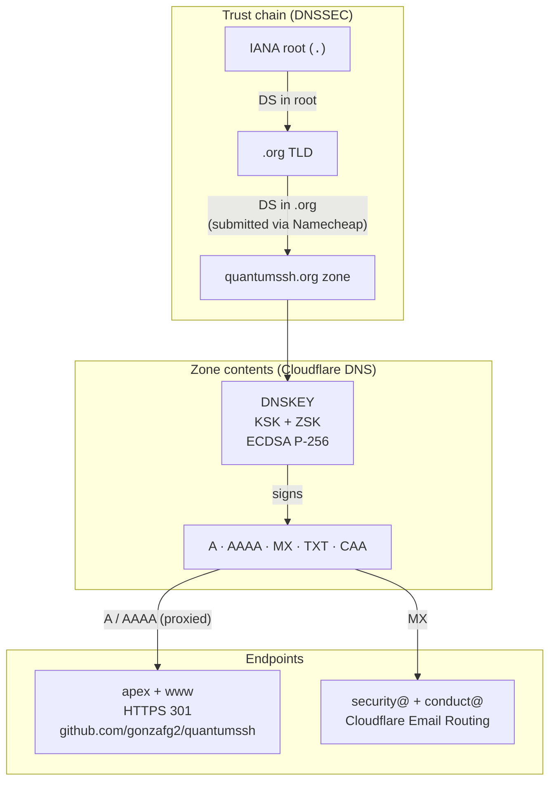

# Operations and verification

QuantumSSH makes a number of operational and cryptographic claims in
`README.md`, `SECURITY.md`, and `GOVERNANCE.md`. The point of this
document is to make it possible for anyone — auditor, contributor,
careful user — to verify those claims independently, without having to
take the maintainers at their word.

Nothing in this guide requires special access. Every check below runs
against public endpoints from any machine with `dig`, `curl`, `openssl`,
`gpg`, `git`, `gh`, and `jq` installed.

If any of the verifications below produces a result that contradicts
this document, that itself is a signal worth reporting through the
embargoed-disclosure process in `SECURITY.md`. Drift from documented
state is meaningful information.

---

## DNS chain of trust (DNSSEC)

The project domain `quantumssh.org` is signed end-to-end. The chain of
trust descends from the IANA root, through the `.org` TLD, down to the
zone hosted on Cloudflare:



You can verify the chain end-to-end:

```sh
# Authenticated Data flag must be set when querying through a
# validating resolver (Cloudflare, Google, Quad9, OpenDNS, Verisign).
dig +adflag quantumssh.org @1.1.1.1 | grep '^;; flags:'
# Expected: flags include "ad", e.g. "flags: qr rd ra ad"

# DS record published in the parent .org zone:
dig +short DS quantumssh.org @1.1.1.1
# Expected: a record with algorithm 13 (ECDSAP256SHA256) and digest type 2 (SHA-256).

# DNSKEY records in the zone itself:
dig +short DNSKEY quantumssh.org @1.1.1.1
# Expected: two records, one KSK (flag 257) and one ZSK (flag 256), algorithm 13.
```

For a graphical chain validator that walks every step:

```
https://dnssec-analyzer.verisignlabs.com/quantumssh.org
```

A common false negative: Lumen / Level3 public resolvers (`4.2.2.2`
and friends) historically do not perform DNSSEC validation, so the
`AD` flag never appears there. Use a validating resolver instead.

## TLS configuration

The web endpoints (apex and `www`) front through Cloudflare with the
following posture:

- TLS 1.2 and 1.3 supported; TLS 1.0 and 1.1 rejected.
- Modern AEAD ciphers only (no CBC, no RC4, no export-grade).
- HSTS active, `max-age=15552000` (six months), `includeSubDomains` set.
- Certificate issued by an authority listed in the project's CAA record.

```sh
# TLS 1.2 and 1.3 must succeed:
echo | openssl s_client -connect www.quantumssh.org:443 \
  -servername www.quantumssh.org -tls1_2 2>&1 | grep -E 'Cipher|Protocol' | head -2
echo | openssl s_client -connect www.quantumssh.org:443 \
  -servername www.quantumssh.org -tls1_3 2>&1 | grep -E 'Cipher|Protocol' | head -2

# TLS 1.0 and 1.1 must fail (cipher should report "(NONE)"):
echo | openssl s_client -connect www.quantumssh.org:443 \
  -servername www.quantumssh.org -tls1   2>&1 | grep "Cipher"
echo | openssl s_client -connect www.quantumssh.org:443 \
  -servername www.quantumssh.org -tls1_1 2>&1 | grep "Cipher"

# HSTS header must be present:
curl -sI https://www.quantumssh.org | grep -i strict-transport-security
# Expected: strict-transport-security: max-age=15552000; includeSubDomains; preload

# Certificate metadata:
echo | openssl s_client -connect www.quantumssh.org:443 \
  -servername www.quantumssh.org 2>&1 | \
  openssl x509 -noout -issuer -subject -dates
```

## Certificate Authority Authorization (CAA)

The domain restricts which Certificate Authorities are allowed to issue
certificates for it. This is defense in depth: even if an attacker
compromises a different CA, that CA is contractually required to refuse
to issue for `quantumssh.org`.

```sh
dig +short CAA quantumssh.org @1.1.1.1 | sort
```

You should see `issue` and `issuewild` records authorising
`letsencrypt.org` and `pki.goog` (plus the auto-managed Cloudflare set
that covers their cert pool), and an `iodef` record routing CAA-violation
notifications to `mailto:security@quantumssh.org`.

## Project PGP key

The project security PGP key is published at
[`keys/security.asc`](../keys/security.asc) and its fingerprint is recorded in
[`SECURITY.md`](../SECURITY.md). To verify the key is authentic without
trusting any single source, cross-check three independent paths and
confirm they all yield the same fingerprint:

**1. Repository copy (raw file):**

```sh
curl -fsSL -o /tmp/quantumssh-security.asc \
  https://raw.githubusercontent.com/gonzafg2/quantumssh/main/keys/security.asc
gpg --show-keys /tmp/quantumssh-security.asc | grep -E '^\s+[0-9A-F]{4}'
```

**2. `SECURITY.md` declaration (different content, same value):**

```sh
curl -fsSL https://raw.githubusercontent.com/gonzafg2/quantumssh/main/SECURITY.md \
  | grep -i 'fingerprint'
```

**3. The canonical value, recorded here:**

```
66DB 5100 B070 0E4A E051  971F 9A8D FF06 AFD2 5B24
```

If all three match, the key is authentic. Only then import it for use:

```sh
gpg --import /tmp/quantumssh-security.asc
```

Encryption subkey: `12A8 BCF0 3709 5A50 06E9  E6F6 4CFE 72E9 E72F A113`.
Algorithm: Ed25519 (sign, cert) plus Curve25519 (encrypt). Expires
2028-05-09; rotation will be announced in this repository ahead of
expiry.

## Signed-commit verification

Every commit on `main` is signed (SSH signature) by the project
maintainer. The branch-protection rule on `main` enforces this server
side, so a commit lacking a verifiable signature cannot land.

To verify a clone independently:

```sh
git clone https://github.com/gonzafg2/quantumssh
cd quantumssh

# Fetch the maintainer's currently uploaded SSH signing keys from
# GitHub's public API (no auth needed) and build a local trust file:
curl -fsSL https://api.github.com/users/gonzafg2/ssh_signing_keys \
  | jq -r '.[] | "gonzafg2@gmail.com \(.key)"' \
  > /tmp/qsh-allowed-signers

# Verify the latest commit:
git -c gpg.format=ssh \
    -c gpg.ssh.allowedSignersFile=/tmp/qsh-allowed-signers \
    log --show-signature -1 main
```

Look for a line beginning `Good "git" signature for gonzafg2@gmail.com`.
If the signature does not validate, do not trust the contents of the
clone.

## Branch protection on `main`

The configuration of `main` is enforced server-side by GitHub. Anyone
can read the protection rules to confirm what is required:

```sh
gh api repos/gonzafg2/quantumssh/branches/main/protection \
  --jq '{
    required_signatures:     .required_signatures.enabled,
    required_status_checks:  .required_status_checks.contexts,
    required_linear_history: .required_linear_history.enabled,
    enforce_admins:          .enforce_admins.enabled
  }'
```

Expected output (formatting irrelevant; values matter):

```json
{
  "required_signatures":     true,
  "required_status_checks":  ["build (ubuntu-latest)", "build (macos-latest)", "cargo deny"],
  "required_linear_history": true,
  "enforce_admins":          true
}
```

A missing or weakened value here is a meaningful event and we would
want to know about it.

## Reporting drift

If any verification above produces a result that contradicts what this
document claims, please:

- For non-sensitive drift (typo, expired link, command no longer works),
  open a regular issue.
- For drift that suggests configuration regression or active compromise
  (signatures failing, DNSSEC chain broken, branch protection silently
  weakened), follow the embargoed channel in
  [`SECURITY.md`](../SECURITY.md).

The maintainer takes verifiability seriously. Reports of drift, even
small ones, are read.
